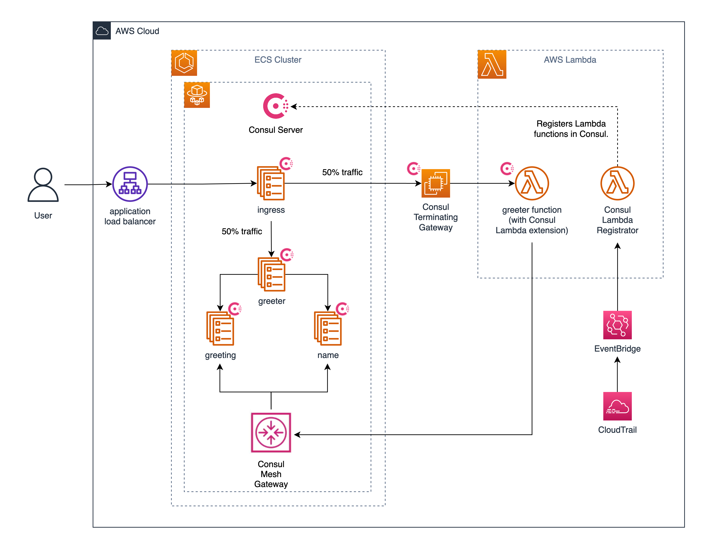

# amazon-ecs-lambda-consul-example

This is an example for using Consul with AWS Lambda. Consul enables ECS services in its service mesh to invoke Lambda functions and Lambda functions to call ECS services in the service mesh.

## Architecture

It deploys a set of ECS services using Fargate:
- ingress
- greeting
- name
- greeter

As well as a Consul cluster with the following:
- Consul server (dev mode on ECS Fargate)
- Consul ACL controller (on ECS Fargate)
- Consul mesh gateway (on ECS Fargate)
- Terminating gateway (EC2)
- Bastion (EC2 for debugging terminating gateway)



## Setup

Go to the Terraform directory.

```shell
cd terraform
```

Set up a `secrets.auto.tfvars` file with an EC2 keypair name
and a list of CIDR blocks for ingress traffic to load balancers
and bastion. You should restrict the CIDR blocks to your machine.

```shell
cat <<EOF > secrets.auto.tfvars
ec2_key_pair_name = "<your EC2 keypair name for bastion>"
ingress_cidrs     = ["<a CIDR block to allow traffic to a load balancer, e.g. your laptop>"]
EOF
```

Initialize Terraform.

```shell
terraform init
```

## Run

### Deploy ECS & Consul Clusters

Make sure your working directory is `terraform/`.

```shell
pwd
```

Apply Terraform, type `yes` to approve changes.

> **NOTE:** If Terraform stops with an error that
  `Secrets Manager Secret...Version "AWSCURRENT" not found`, run `terraform apply` again.

```shell
terraform apply
```

### Deploy ECS Services for Greeter, Greeting, and Name

Change up to the root-level directory.

```shell
cd ..
```

Push all images related to the greetings application and Consul
Lambda registrator to Amazon ECR.

```shell
bash services/build.sh
```

Return to the Terraform directory.

```shell
cd terraform
```

Go to `toggles.auto.tfvars` and set `deploy_ecs_services = true`.

Apply Terraform, type `yes` to approve changes.

```shell
terraform apply
```

Once all services have deployed, you can check if the greeter
service works by making a request to the ingress load balancer address.
The ingress service calls greeter, which retrieves
greeting option and name option.

```shell
$ curl $(terraform output -raw ingress_lb_address)

From ip-x-x-x-x.ec2.internal: From ip-x-x-x-x.ec2.internal: Hello (ip-x-x-x-x.ec2.internal) Michael (ip-x-x-x-x.ec2.internal)
```

### Deploy Consul Lambda Registrator

Go to `toggles.auto.tfvars` and set `deploy_consul_lambda = true`.
This creates the Consul Lambda registrator, which registers
Lambda functions to the Consul cluster.

Apply Terraform, type `yes` to approve changes.

```shell
terraform apply
```

### Deploy Greeter Service as Lambda

Change up to the root-level directory.

```shell
cd ..
```

Retrieve and package Lambda functions and Consul Lambda
extension. The extension allows Lambda to
call ECS services in Consul's service mesh.

```shell
bash lambda/build.sh
```

Return to the Terraform directory.

```shell
cd terraform
```

Go to `toggles.auto.tfvars` and set `deploy_lambda = true`.

Apply Terraform, type `yes` to approve changes.

```shell
terraform apply
```

Test that the greeter function works by sending 50% of traffic
to the greeter function.

Go to `toggles.auto.tfvars` and set `migrate_to_lambda = true`.

Apply Terraform, type `yes` to approve changes.

```shell
terraform apply
```

You can check if the greeter
service works by making a request to the ingress load balancer address.
The ingress service calls greeter, which retrieves
greeting option and name option. Make a few requests. Half the
responses should return that the greeter is using its Lambda
function.

```shell
$ curl $(terraform output -raw ingress_lb_address)

From ip-x-x-x-x.ec2.internal: From lambda: Hey (ip-x-x-x-x.ec2.internal) Linda (ip-x-x-x-x.ec2.internal)

$ curl $(terraform output -raw ingress_lb_address)

From ip-x-x-x-x.ec2.internal: From ip-x-x-x-x.ec2.internal: Hey (ip-x-x-x-x.ec2.internal) William (ip-x-x-x-x.ec2.internal)
```

The ingress service invokes the greeter function using a Consul
terminating gateway, while the greeter function calls the greeting and name
services in ECS using the Consul Lambda extension.

## Clean Up

Make sure your working directory is `terraform/`.

```shell
pwd
```

Go to `toggles.auto.tfvars` and set `migrate_to_lambda = false`.

Apply Terraform, enter `yes` to approve.

```shell
terraform apply
```

Go to `toggles.auto.tfvars` and set `deploy_lambda = false`.

Apply Terraform, enter `yes` to approve.

```shell
terraform apply
```

Go to `toggles.auto.tfvars` and set `deploy_consul_lambda = false`.

Apply Terraform, type `yes` to approve changes.

```shell
terraform apply
```

Go to `toggles.auto.tfvars` and set `deploy_ecs_services = false`.

Apply Terraform, type `yes` to approve changes.

```shell
terraform apply
```

Destroy resources using Terraform, type `yes` to approve changes.

```shell
terraform destroy
```

## References

- [Consul with AWS Lambda](https://developer.hashicorp.com/consul/docs/lambda)
- [Consul Lambda Registrator for Terraform](https://registry.terraform.io/modules/hashicorp/consul-lambda-registrator/aws/latest/submodules/lambda-registrator)
- [Consul Lambda Extension](https://developer.hashicorp.com/consul/docs/lambda/invoke-from-lambda)

## Security

See [CONTRIBUTING](CONTRIBUTING.md#security-issue-notifications) for more information.

## License

This library is licensed under the MIT-0 License. See the LICENSE file.

